# Introdução

Informações básicas do projeto.

* **Projeto:** [MONEO]
* **Repositório GitHub:** [REPOSITÓRIO](https://github.com/ICEI-PUC-Minas-PPLES-TI/plf-es-2024-2-ti1-0385100-gestao-de-educacao-financeira.git)
* **Membros da equipe:**

  * [Beatriz Camila](https://github.com/beacmartins); 
  * [Eduarda Vieira](https://github.com/eduardavieira-dev);
  * [Eric Leal](https://github.com/Eric-Leal);
  * [Guilherme Rodrigues](https://github.com/marquezzinn);
  * [Gustavo Montanari](https://github.com/Duelixta);
  * [Laura Pontara](https://github.com/LauraPontara).

A documentação do projeto é estruturada da seguinte forma:

1. Introdução
2. Contexto
3. Product Discovery
4. Product Design
5. Metodologia
6. Solução
7. Referências Bibliográficas

✅ [Documentação de Design Thinking (MIRO)](files/processo-dt.pdf)

# Contexto

Detalhes sobre o espaço de problema, os objetivos do projeto, sua justificativa e público-alvo.

## Problema

A falta de gestão e educação financeira é um dos maiores obstáculos para as pessoas atingirem sua independência financeira. Sem o conhecimento necessário, é fácil se endividar, não conseguir poupar e tomar decisões equivocadas. A educação financeira, por sua vez, capacita as pessoas a controlarem seus gastos, planejarem o futuro, investirem de forma inteligente e alcançar seus objetivos, visto que, ao aprender a gerenciar seu dinheiro, você adquire as ferramentas para tomar decisões mais conscientes, construir um patrimônio e viver com mais tranquilidade, livre das preocupações monetárias.

## Objetivos

> O objetivo geral deste projeto é desenvolver um software intuitivo que auxilie os usuários a lidarem com a falta de gestão e educação financeira, proporcionando ferramentas que os ajudem a controlar seus gastos, adquirir conhecimento sobre investimentos e boas práticas de finanças.

### Objetivos específicos:

- Auxiliar na organização de despesas pessoais, permitindo ao usuário planejar e monitorar seu orçamento de forma prática e eficiente;
- Informar sobre boas práticas de investimentos, oferecendo dicas e orientações que ajudem o usuário a tomar decisões financeiras mais conscientes e estratégicas;
- Fornecer uma calculadora financeira a fim de auxiliar o usuário a calcular montantes;
- Informar sobre opções de consórcio;
- Mostrar notícias relevantes do mercado financeiro;
- Fornecer informações sobre possíveis vagas de emprego para usuários que tenham interesse.

## Justificativa

> A escolha do tema “Falta de gestão e educação financeira” para o desenvolvimento do projeto de software foi motivada pela crescente necessidade de abordar a inadimplência e a falta de conhecimento financeiro entre os brasileiros. De acordo com dados da Serasa, o Brasil registrou um aumento de 136 mil consumidores inadimplentes em julho de 2024, totalizando 72,66 milhões de pessoas em situação de inadimplência. Além disso, uma pesquisa da Agência Brasil revela que apenas 31% dos brasileiros buscam frequentemente dicas de especialistas sobre gestão financeira, e 49% nunca participam de cursos ou seminários sobre o tema. Esses dados evidenciam a urgência de ferramentas que promovam a educação financeira e auxiliem na gestão de finanças pessoais.

> Os objetivos específicos foram escolhidos em razão de que, com essas funções, o software se tornará uma ferramenta eficaz e eficiente para o foco do projeto, que é auxiliar na organização e educação monetária dos usuários, visando desenvolver uma aplicação que não apenas informe, mas também eduque os usuários sobre práticas financeiras saudáveis, contribuindo para a redução da inadimplência e melhorando a qualidade de vida financeira dos clientes.

## Público-Alvo

> O público-alvo do MONEO é composto por pessoas na faixa etária de 20 a 50 anos, focando especialmente em assalariados que buscam uma melhor organização financeira. Este grupo inclui jovens profissionais, trabalhadores em meio de carreira e até aqueles que se aproximam da aposentadoria, todos enfrentando desafios relacionados ao gerenciamento de suas finanças pessoais. A plataforma atende a necessidades como controle de gastos, planejamento de orçamento e auxílio na realização de metas financeiras, proporcionando uma experiência intuitiva e prática para usuários que desejam ter mais controle sobre suas finanças.

# Product Discovery

## Etapa de Entendimento

### Matriz CSD e Mapa de stakeholders
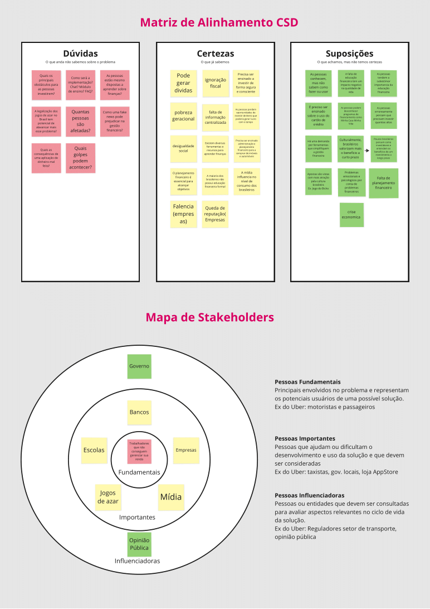

### Entrevistas qualitativas
#### Entrevista 1


#### Entrevista 2


#### Entrevista 3 
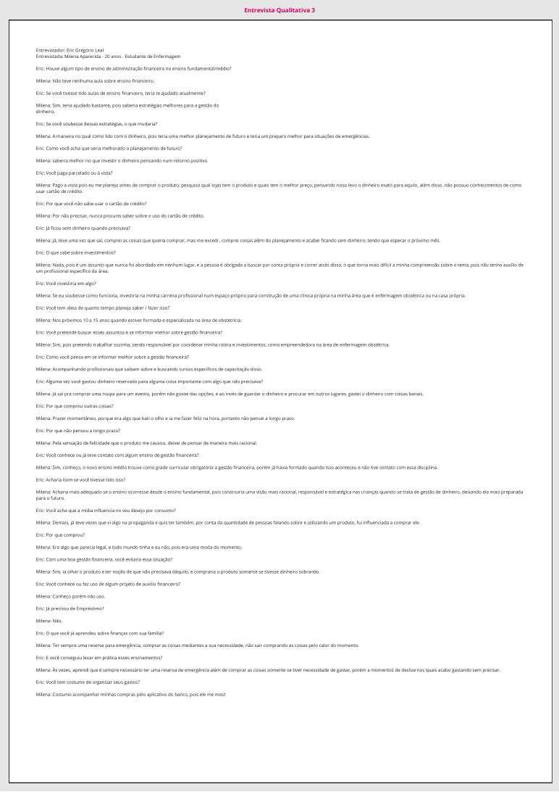

#### Entrevista 4 
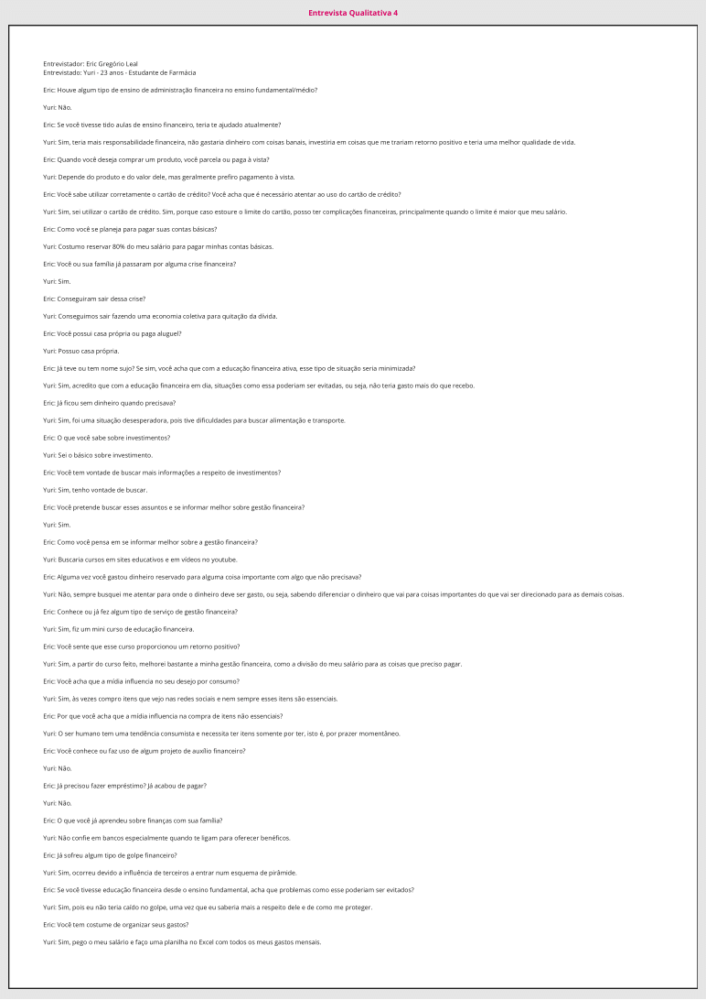

#### Entrevista 5 
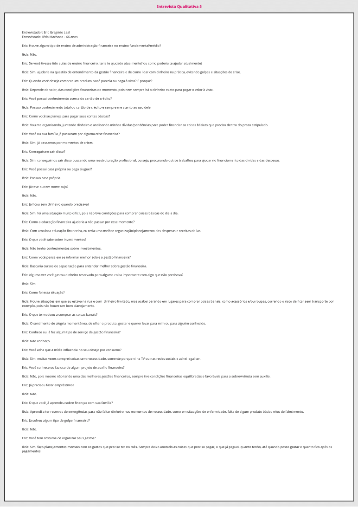

#### Entrevista 6 
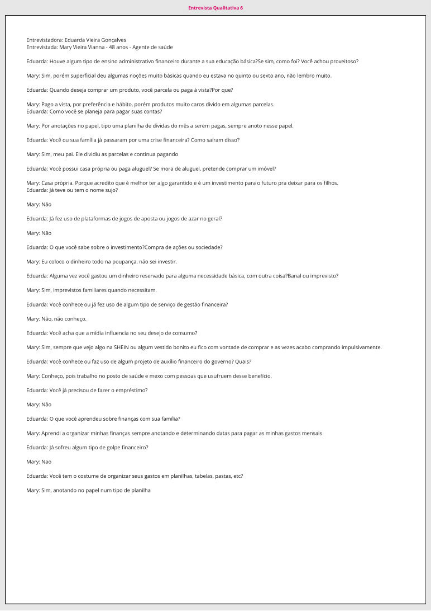

#### Entrevista 7 
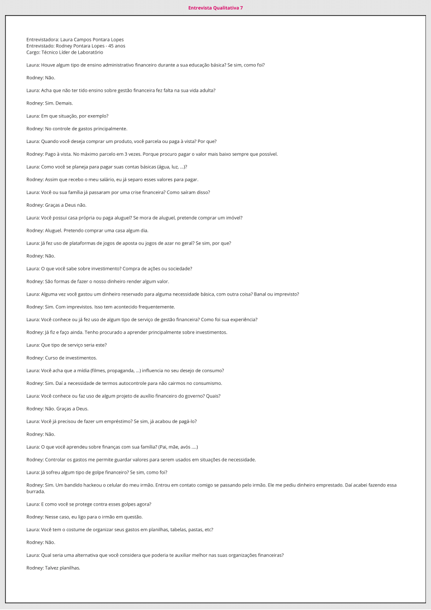

#### Entrevista 8
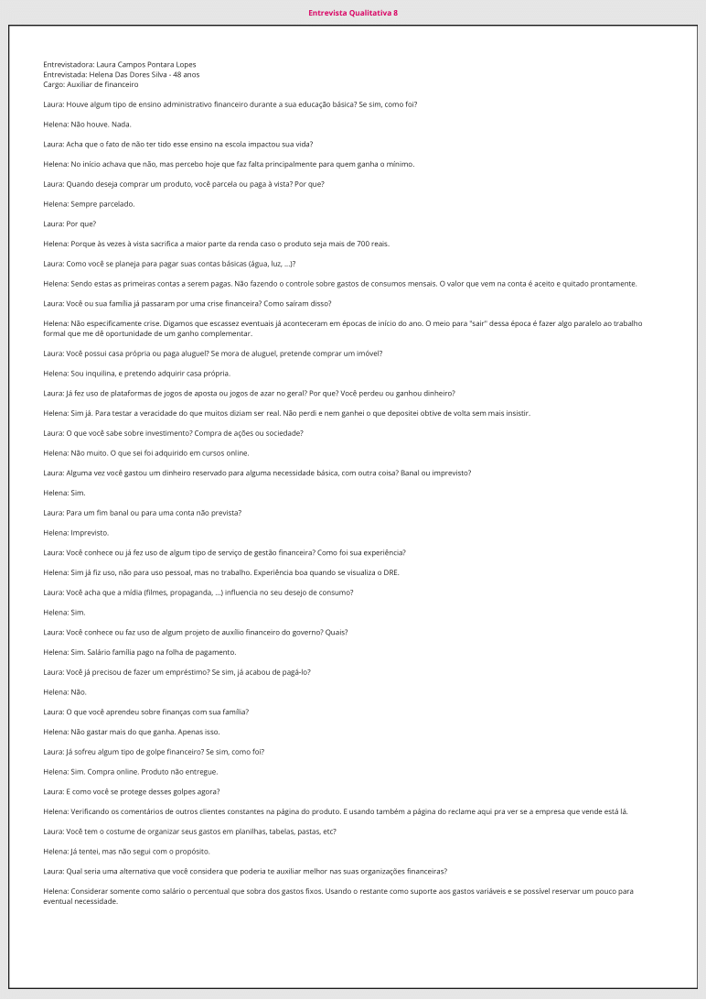

#### Entrevista 9 
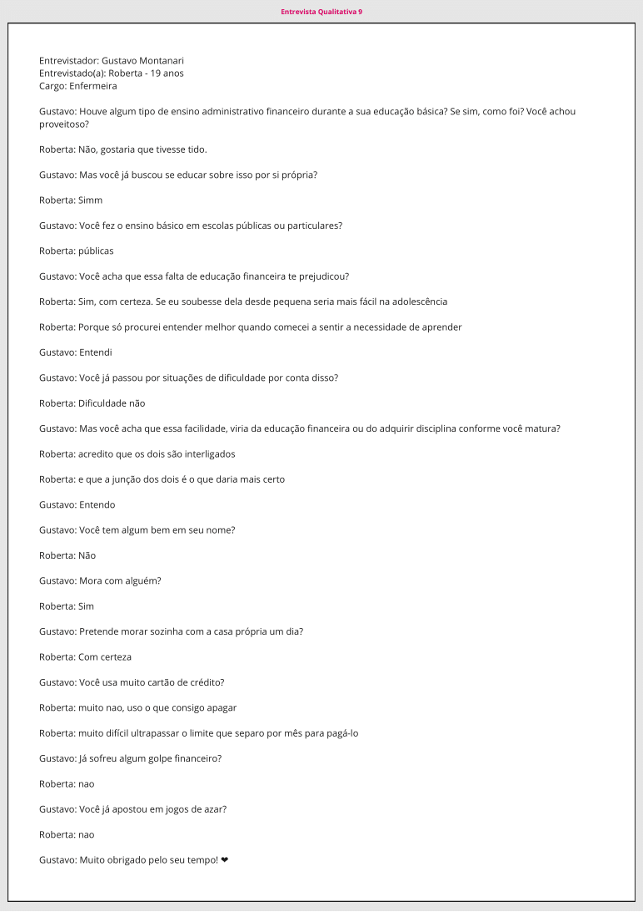

#### Entrevista 10  


#### Entrevista 11
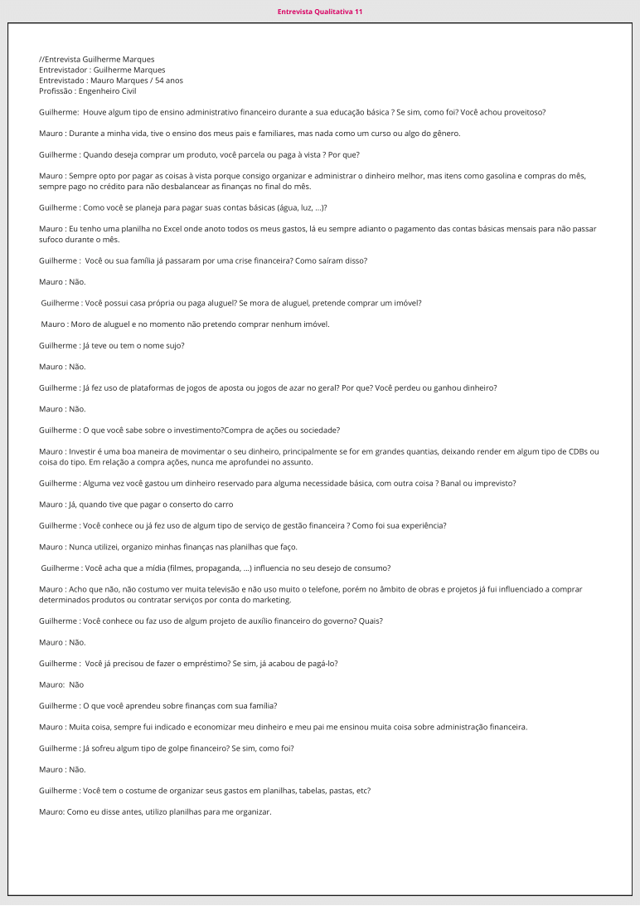

#### Entrevista 12
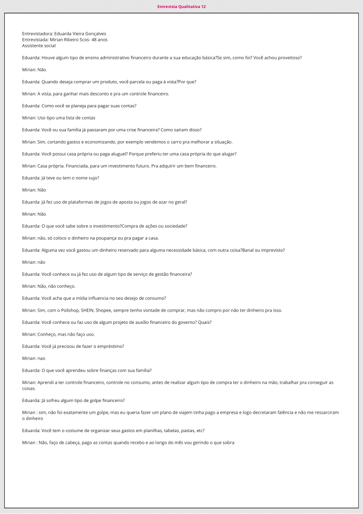

### Highlights de pesquisa
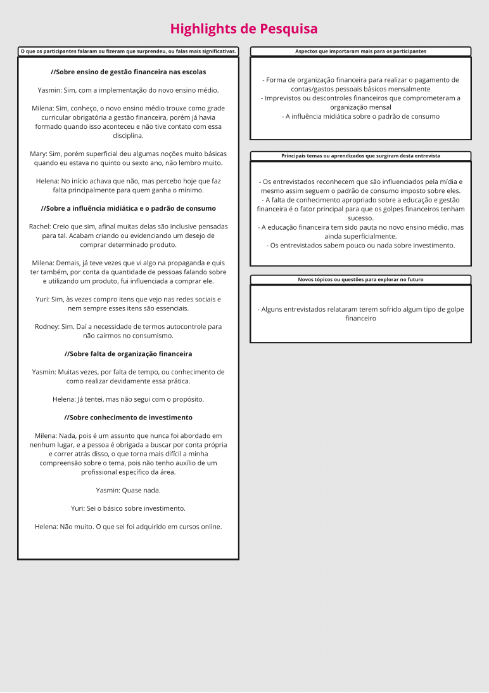

## Etapa de Definição

### Personas

**✳️✳️✳️ APRESENTE OS DIAGRAMAS DE PERSONAS ✳️✳️✳️**

> ⚠️ **APAGUE ESSA PARTE ANTES DE ENTREGAR SEU TRABALHO**
>
> Relacione as personas identificadas no seu projeto e os respectivos mapas de empatia. Lembre-se que você deve ser enumerar e descrever precisamente e de forma personalizada todos os principais envolvidos com a solução almeja.
>
> **Orientações**:
>
> - [Persona x Público-alvo](https://flammo.com.br/blog/persona-e-publico-alvo-qual-a-diferenca/)
> - [O que é persona?](https://resultadosdigitais.com.br/blog/persona-o-que-e/)
> - [Rock Content](https://rockcontent.com/blog/personas/)
> - [Criar personas (Hotmart)](https://blog.hotmart.com/pt-br/como-criar-persona-negocio/)

# Product Design

Nesse momento, vamos transformar os insights e validações obtidos em soluções tangíveis e utilizáveis. Essa fase envolve a definição de uma proposta de valor, detalhando a prioridade de cada ideia e a consequente criação de wireframes, mockups e protótipos de alta fidelidade, que detalham a interface e a experiência do usuário.

## Histórias de Usuários

Com base na análise das personas foram identificadas as seguintes histórias de usuários:

| EU COMO...            | QUERO/PRECISO ...                          | PARA ...                               |
| --------------------- | ------------------------------------------ | -------------------------------------- |
| Estudante universitária | Organizar minhas finanças | Para alcançar minha independência financeira |  
| CLT Analista Financeira    | Auxilio para investir | Para conseguir um retorno com o investimento e dar uma vida melhor para a familia |
| Pai de familia  | Organizar minhas finanças | Para evitar gastos imprevistos e me aposentar |
| Trabalhador | Aprender sobre investimentos | Para ampliar minhas opções de renda |
| Mãe e estudante | informações sobre como financiar um imovel | Para conquistar minha casa propria |
| Jovem adulta | Controlar meus gastos | Para conseguir mora sozinha |

## Proposta de Valor

### Proposta para Persona Rachel 


### Proposta para Persona Melissa 

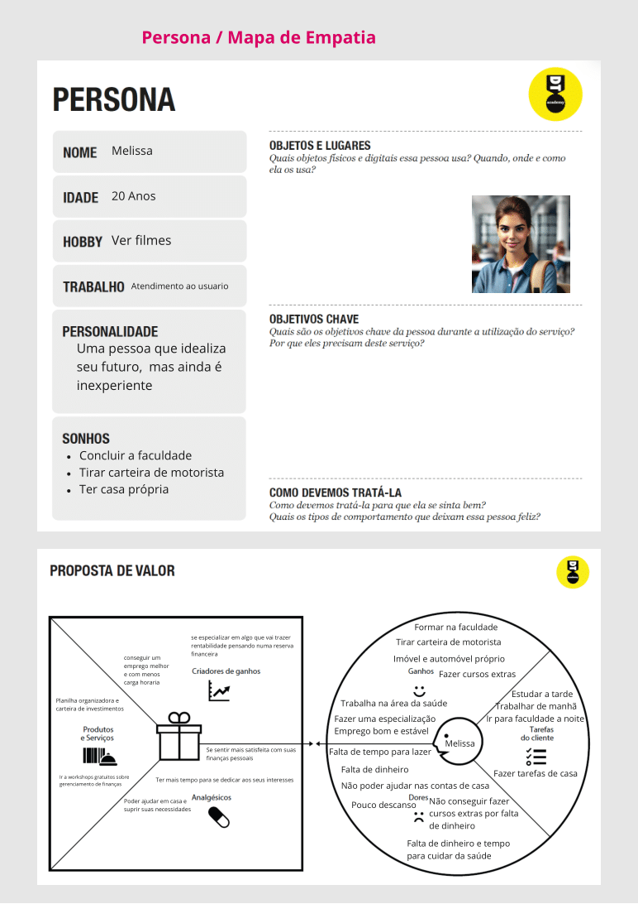

### Proposta para Persona Rodrigo 

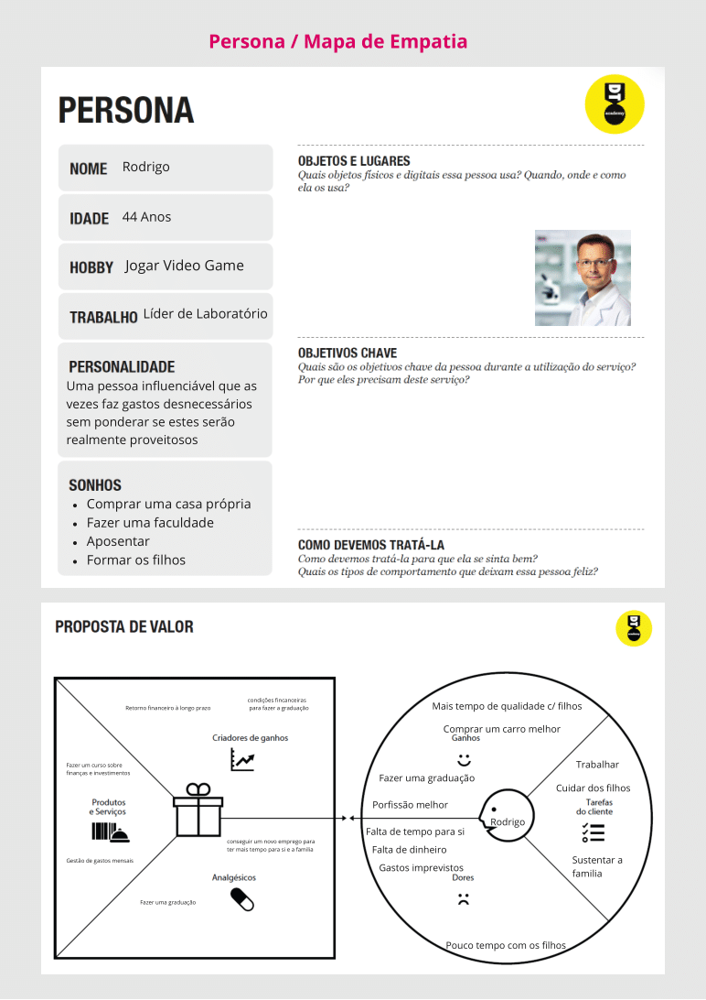

## Requisitos

As tabelas que se seguem apresentam os requisitos funcionais e não funcionais que detalham o escopo do projeto.

### Requisitos Funcionais
| ID     | Descrição do Requisito                                   | Prioridade |
| ------ | ---------------------------------------------------------- | ---------- |
| RF-001 | Permitir que os usuários criem contas com informações como nome, e-mail e senha. | ALTA       |
| RF-002 | Permitir que os usuários atualizem suas informações pessoais e preferências. | MÉDIA     |
| RF-003 |  Opção para recuperar senha por meio de e-mail. | MÉDIA     |
| RF-004 | Permitir que os usuários adicionem receitas e despesas com detalhes como valor, data, categoria e descrição. | MÉDIA     |
| RF-005 | Permitir que os usuários estabeleçam e acompanhem metas financeiras (como poupança ou redução de dívida). | MÉDIA     |
| RF-006 | Gerar relatórios mensais, trimestrais ou anuais das receitas, despesas e saldo. | ALTA     |
| RF-007 | Fornecer insights sobre padrões de gastos, como principais categorias de despesas e mudanças ao longo do tempo. |  ALTA     |
| RF-008 | Notificar os usuários quando estiverem próximos de atingir o limite do orçamento. | ALTA     |
| RF-009 | Opção para configurar lembretes para registrar transações recorrentes. | MÉDIA     |   
| RF-010 | Atualizações sobre o progresso das metas financeiras definidas. | ALTA     |
| RF-011 | Opção para exportar transações e relatórios em formato CSV ou PDF. | MÉDIA     | 
| RF-012 | Seção de perguntas frequentes e tutoriais para ajudar os usuários a utilizar a plataforma. | MÉDIA     | 
| RF-013 |  Canal de comunicação para suporte ao cliente, como chat ao vivo ou formulário de contato. | ALTA     |
| RF-014 |  Ferramentas como calculadoras de juros compostos, empréstimos e investimentos. | ALTA     |


   
### Requisitos não Funcionais

| ID      | Descrição do Requisito                                                              | Prioridade |
| ------- | ------------------------------------------------------------------------------------- | ---------- |
| RNF-001 | Implementação de criptografia para proteger dados sensíveis dos usuários. | ALTA     |
| RNF-002 | Controle de acesso baseado em funções para recursos do site. | MÉDIA     |
| RNF-003 | Exibir uma política de privacidade clara sobre como os dados dos usuários serão usados e protegidos. | ALTA     | 
| RNF-004 | Conectar-se a APIs de bancos para importar transações automaticamente. | ALTA     | 
| RNF-005 | Suporte para múltiplas moedas e taxas de câmbio. | ALTA     | 
| RNF-006 | Suporte para diferentes idiomas. | MÉDIA     | 


## Projeto de Interface

Artefatos relacionados com a interface e a interacão do usuário na proposta de solução.

### Wireframes

Estes são os protótipos de telas do sistema.

##### Landing Page Moneo 

Essa é uma landing page para que o usuário posssa navegar pelas funcionalidades do sistema após fazer o login/cadastro. Nessa tela ficam as informações centrais do site.

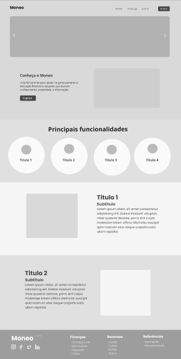


### User Flow

**✳️DIAGRAMA DE FLUXO DE TELAS ✳️**


### Protótipo Interativo

✅ [Protótipo Interativo (Figma)](https://www.figma.com/design/hECitfhANxNDXAvHaSZPwe/Userflow-Moneo?node-id=0-1&t=uZQqr633qPvcDpns-1)  


# Metodologia

Detalhes sobre a organização do grupo e o ferramental empregado.

## Ferramentas

Relação de ferramentas empregadas pelo grupo durante o projeto.

| Ambiente                    | Plataforma | Link de acesso                                     |
| --------------------------- | ---------- | -------------------------------------------------- |
| Processo de Design Thinking | Miro       | https://miro.com/XXXXXXX ⚠️ EXEMPLO ⚠️        |
| Repositório de código     | GitHub     | https://github.com/XXXXXXX ⚠️ EXEMPLO ⚠️      |
| Hospedagem do site          | Render     | https://site.render.com/XXXXXXX ⚠️ EXEMPLO ⚠️ |
| Protótipo Interativo       | MarvelApp  | https://marvelapp.com/XXXXXXX ⚠️ EXEMPLO ⚠️   |
|                             |            |                                                    |

> ⚠️ **APAGUE ESSA PARTE ANTES DE ENTREGAR SEU TRABALHO**
>
> Liste as ferramentas empregadas no desenvolvimento do projeto, justificando a escolha delas, sempre que possível. Inclua itens como: (1) Editor de código, (2) )ferramentas de comunicação, (3) )ferramentas de diagramação, (4) )plataformas de hospedagem, entre outras.

## Gerenciamento do Projeto

Divisão de papéis no grupo e apresentação da estrutura da ferramenta de controle de tarefas (Kanban).


> ⚠️ **APAGUE ESSA PARTE ANTES DE ENTREGAR SEU TRABALHO**
>
> Nesta parte do documento, você deve apresentar  o processo de trabalho baseado nas metodologias ágeis, a divisão de papéis e tarefas, as ferramentas empregadas e como foi realizada a gestão de configuração do projeto via GitHub.
>
> Coloque detalhes sobre o processo de Design Thinking e a implementação do Framework Scrum seguido pelo grupo. O grupo poderá fazer uso de ferramentas on-line para acompanhar o andamento do projeto, a execução das tarefas e o status de desenvolvimento da solução.
>
> **Orientações**:
>
> - [Sobre Projects - GitHub Docs](https://docs.github.com/pt/issues/planning-and-tracking-with-projects/learning-about-projects/about-projects)
> - [Gestão de projetos com GitHub | balta.io](https://balta.io/blog/gestao-de-projetos-com-github)
> - [(460) GitHub Projects - YouTube](https://www.youtube.com/playlist?list=PLiO7XHcmTsldZR93nkTFmmWbCEVF_8F5H)
> - [11 Passos Essenciais para Implantar Scrum no seu Projeto](https://mindmaster.com.br/scrum-11-passos/)
> - [Scrum em 9 minutos](https://www.youtube.com/watch?v=XfvQWnRgxG0)

# Solução Implementada

Esta seção apresenta todos os detalhes da solução criada no projeto.

## Vídeo do Projeto

O vídeo a seguir traz uma apresentação do problema que a equipe está tratando e a proposta de solução. ⚠️ EXEMPLO ⚠️

[](https://www.youtube.com/embed/70gGoFyGeqQ)

> ⚠️ **APAGUE ESSA PARTE ANTES DE ENTREGAR SEU TRABALHO**
>
> O video de apresentação é voltado para que o público externo possa conhecer a solução. O formato é livre, sendo importante que seja apresentado o problema e a solução numa linguagem descomplicada e direta.
>
> Inclua um link para o vídeo do projeto.

## Funcionalidades

Esta seção apresenta as funcionalidades da solução.Info

##### Funcionalidade 1 - Cadastro de Contatos ⚠️ EXEMPLO ⚠️

Permite a inclusão, leitura, alteração e exclusão de contatos para o sistema

* **Estrutura de dados:** [Contatos](#ti_ed_contatos)
* **Instruções de acesso:**
  * Abra o site e efetue o login
  * Acesse o menu principal e escolha a opção Cadastros
  * Em seguida, escolha a opção Contatos
* **Tela da funcionalidade**:


> ⚠️ **APAGUE ESSA PARTE ANTES DE ENTREGAR SEU TRABALHO**
>
> Apresente cada uma das funcionalidades que a aplicação fornece tanto para os usuários quanto aos administradores da solução.
>
> Inclua, para cada funcionalidade, itens como: (1) titulos e descrição da funcionalidade; (2) Estrutura de dados associada; (3) o detalhe sobre as instruções de acesso e uso.

## Estruturas de Dados

Descrição das estruturas de dados utilizadas na solução com exemplos no formato JSON.Info

##### Estrutura de Dados - Contatos   ⚠️ EXEMPLO ⚠️

Contatos da aplicação

```json
  {
    "id": 1,
    "nome": "Leanne Graham",
    "cidade": "Belo Horizonte",
    "categoria": "amigos",
    "email": "Sincere@april.biz",
    "telefone": "1-770-736-8031",
    "website": "hildegard.org"
  }
  
```

##### Estrutura de Dados - Usuários  ⚠️ EXEMPLO ⚠️

Registro dos usuários do sistema utilizados para login e para o perfil do sistema

```json
  {
    id: "eed55b91-45be-4f2c-81bc-7686135503f9",
    email: "admin@abc.com",
    id: "eed55b91-45be-4f2c-81bc-7686135503f9",
    login: "admin",
    nome: "Administrador do Sistema",
    senha: "123"
  }
```

> ⚠️ **APAGUE ESSA PARTE ANTES DE ENTREGAR SEU TRABALHO**
>
> Apresente as estruturas de dados utilizadas na solução tanto para dados utilizados na essência da aplicação quanto outras estruturas que foram criadas para algum tipo de configuração
>
> Nomeie a estrutura, coloque uma descrição sucinta e apresente um exemplo em formato JSON.
>
> **Orientações:**
>
> * [JSON Introduction](https://www.w3schools.com/js/js_json_intro.asp)
> * [Trabalhando com JSON - Aprendendo desenvolvimento web | MDN](https://developer.mozilla.org/pt-BR/docs/Learn/JavaScript/Objects/JSON)

## Módulos e APIs

Esta seção apresenta os módulos e APIs utilizados na solução

**Images**:

* Unsplash - [https://unsplash.com/](https://unsplash.com/) ⚠️ EXEMPLO ⚠️

**Fonts:**

* Icons Font Face - [https://fontawesome.com/](https://fontawesome.com/) ⚠️ EXEMPLO ⚠️

**Scripts:**

* jQuery - [http://www.jquery.com/](http://www.jquery.com/) ⚠️ EXEMPLO ⚠️
* Bootstrap 4 - [http://getbootstrap.com/](http://getbootstrap.com/) ⚠️ EXEMPLO ⚠️

> ⚠️ **APAGUE ESSA PARTE ANTES DE ENTREGAR SEU TRABALHO**
>
> Apresente os módulos e APIs utilizados no desenvolvimento da solução. Inclua itens como: (1) Frameworks, bibliotecas, módulos, etc. utilizados no desenvolvimento da solução; (2) APIs utilizadas para acesso a dados, serviços, etc.

# Referências

As referências utilizadas no trabalho foram:

* SOBRENOME, Nome do autor. Título da obra. 8. ed. Cidade: Editora, 2000. 287 p ⚠️ EXEMPLO ⚠️

> ⚠️ **APAGUE ESSA PARTE ANTES DE ENTREGAR SEU TRABALHO**
>
> Inclua todas as referências (livros, artigos, sites, etc) utilizados no desenvolvimento do trabalho.
>
> **Orientações**:
>
> - [Formato ABNT](https://www.normastecnicas.com/abnt/trabalhos-academicos/referencias/)
> - [Referências Bibliográficas da ABNT](https://comunidade.rockcontent.com/referencia-bibliografica-abnt/)
